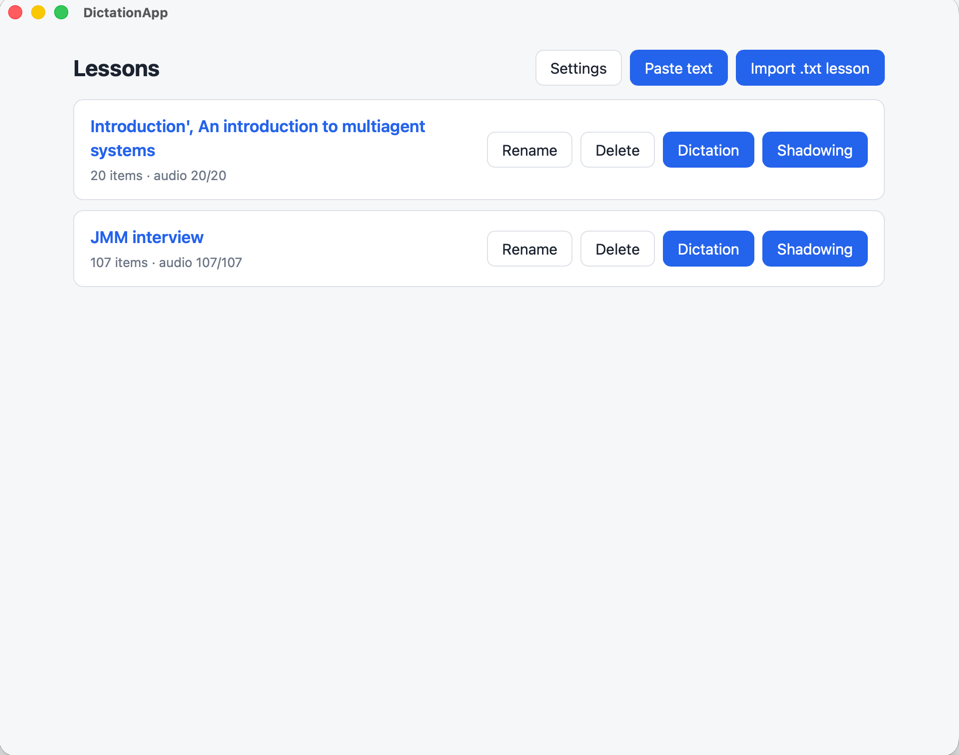
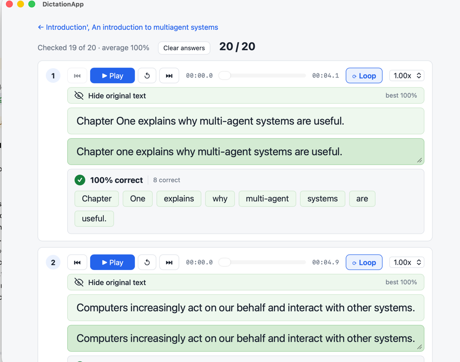
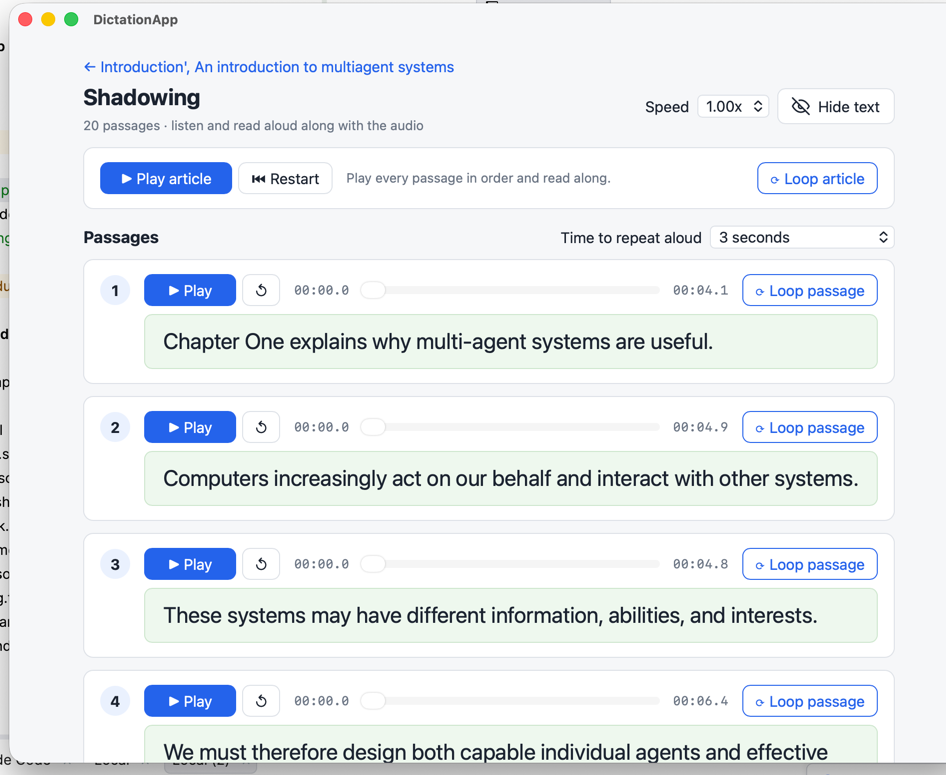

# DictationApp — English Dictation & Shadowing

**Train your ears. Find your speaking rhythm. Learn with text you care about.**

Turn English articles, study notes or interview answers into listening and speaking practice.
Use **Dictation** to type what you hear and spot missed words. Use **Shadowing** to repeat a difficult
passage until it feels natural, then read along with the whole article. One lesson, two separate
practice modes, shared audio.

[Download](https://github.com/richardgong1987/DictationApp/releases/latest) ·
[Quick start](#quick-start) · [User guide](docs/USER_GUIDE.md) ·
[Transfer lessons and audio](#transfer-lessons-and-audio-between-devices) ·
[Build from source](docs/DEVELOPMENT.md)

## Why I built DictationApp

I believe language learning should begin like a child learning from their mother: the mother says
one sentence, and the child tries to say it back. Listen, follow, repeat. Before expecting fluent
conversation, we need to be able to stay with a spoken sentence from beginning to end.

To me, being able to keep up and repeat a sentence is already half the battle. Many learners of a
second language struggle at this first step: the speech moves on before they can hold on to its
words, sounds and rhythm. When they cannot follow the sentence, it becomes difficult to catch
what was said and learn from it.

In the AI era, creating a natural spoken model for the material we want to learn is no longer the
obstacle it once was. We do not have to ask someone to say the same sentence over and over: the
app can replay it patiently, as many times as we need. Once a clip is generated and cached, those
repetitions reuse the same audio. That lets us focus on exactly what we cannot yet follow or say,
and keep working on it until we get past the bottleneck.

I built DictationApp to make that practice possible at your own pace. Take one short passage,
listen to it, slow it down if needed, and repeat it aloud until you can keep up. Shadowing gives
you the model voice and time to answer it; dictation helps you notice the words you missed.
Once individual passages feel familiar, read along with the whole article to build continuity.

The goal is simple: **first learn to follow a sentence, then learn to say it with confidence.**
This is my personal learning philosophy and the reason for this project.

## Two ways to practice

| | Dictation — listening and typing | Shadowing — listening and speaking |
|---|---|---|
| Open it | **Dictation** on a lesson card or lesson detail page | **Shadowing** on a lesson card or lesson detail page |
| Practice | Listen, replay, type, then reveal the original | Read aloud with the audio or during the repeat pause |
| Focus on a hard passage | Replay, loop, seek and slow it down | **Loop passage**, with time to repeat aloud |
| Review | Word-by-word feedback and accuracy | Listen and judge your own fluency; no recording or pronunciation score |
| Continue | Answers save automatically; resume your dictation | **Play article** for all passages in order; **Loop article** to repeat |

Both modes use the same locally cached MP3s. Switching modes does not require a second set of audio.

## Screenshots

These screenshots illustrate the practice modes. The current interface uses a more compact,
full-width card layout; see the [screen guide](docs/USER_GUIDE.md#find-your-way-around) for current controls.

### Lesson library — choose Dictation or Shadowing



### Dictation — listen, type and check each word



### Shadowing — practice one passage, then read the whole article



## Download and install

Open the [latest release](https://github.com/richardgong1987/DictationApp/releases/latest), expand
**Assets**, and download the installer for your computer. You do **not** need Rust, Node.js or pnpm
to use a downloaded desktop installer. The **Source code** archives are for building the app yourself.

| Your computer | Download |
|---|---|
| Mac — Apple Silicon or Intel | `DictationApp_<version>_universal.dmg` |
| Windows x64 | `DictationApp_<version>_x64-setup.exe` or `.msi` |
| Linux x86_64 | `.AppImage`, `.deb` for Debian/Ubuntu, or `.rpm` for RPM-based systems |

- **macOS:** open the `.dmg` and drag the app into Applications. The app is not code-signed yet;
  if macOS blocks it, use **System Settings → Privacy & Security → Open Anyway** after attempting to open it.
- **Windows:** run the installer. If SmartScreen blocks this project's installer, use **More info → Run anyway**.
- **Linux:** install the appropriate package, or make the AppImage executable with
  `chmod +x DictationApp_*.AppImage` and run it. System-library compatibility still depends on your distribution.

The repository also includes iOS build/install scripts for use with a Mac and Xcode. These are a
separate [source-build route](docs/DEVELOPMENT.md#build-an-installer), not an App Store download or a desktop installer for iPhone.

## Quick start

If you already have a DictationApp lesson ZIP with ready audio, you can
[import it first](#transfer-lessons-and-audio-between-devices) and practice without configuring API keys.
Keys are needed only when generating missing audio or replacing existing clips.

### 1. Set up a voice

Open **Settings → Text-to-speech → Provider** and choose one provider:

| Provider | What to enter |
|---|---|
| Microsoft Azure Speech | Your Speech resource **Key**, its matching **Region**, and a **Voice name** such as `en-US-JennyNeural` or `en-GB-SoniaNeural` |
| ElevenLabs | Your **API key**, a **Voice ID** from your voice library, and a supported **Model**; the default is `eleven_multilingual_v2` |

Click **Save**, then **Back**. Get your own credentials from
[Azure Speech](https://azure.microsoft.com/products/ai-services/text-to-speech) or
[ElevenLabs](https://elevenlabs.io). Generating audio requires internet access and uses your provider's
quota or credits; replaying an unchanged cached clip does not send another synthesis request.

### 2. Add your text

From **Lessons**, choose **Paste text**, enter your material and an optional title, then click
**Create lesson**. Alternatively, choose **Import .txt lesson** and select a UTF-8 text file.
Try [lesson01.txt](examples/lesson01.txt) for a small example.

**Separate passages with a blank line.** Each block becomes one practice item and one audio clip.
The app does not split text automatically at full stops. For sentence-by-sentence practice, put a
blank line after each sentence:

```text
I should have told you earlier.

The meeting has been moved to Friday afternoon.

If I had known about the problem, I would have called you.
```

Lines inside the same block are joined. Passages longer than 30 words show a suggestion to shorten
them, but are still allowed. Short blocks make replaying difficult sentences easier.

### 3. Prepare the audio

When credentials are configured, creating a lesson starts audio generation automatically.
On the lesson detail page, **Generate missing audio** fills gaps and updates outdated clips.
Wait for the audio count to reach the number of items before an uninterrupted practice session.
If some clips fail, check Settings and your connection, then retry generation.

Audio is saved locally and shared by both modes. **Regenerate all** forces new synthesis requests;
use it when you deliberately want to replace the audio.

### 4. Choose your practice mode

Return to **Lessons**, or stay on the lesson detail page, and select **Dictation** or **Shadowing**.
These are separate buttons, so you can choose listening/typing or reading aloud directly.

## Dictation: listen → type → check

1. Click **Play** on a passage. The original text starts hidden for an unchecked item.
2. Type what you hear. Replay, use **Loop**, drag the seek bar or lower the playback speed as needed.
3. Press **Enter** in the answer box, or click **Show original text**, to check and reveal the answer.
4. Review the accuracy and the correct, changed, missing and extra words. Small words such as
   *a*, *the* and *to* count; capitalization and surrounding punctuation are ignored.
5. Click **Hide original text** to edit and try again, or press **Enter** again to move to the next item.

Answers save automatically after a brief typing pause. Reopening **Dictation** resumes around your
last answered item. **Clear answers** starts a fresh attempt at the lesson; previous attempt statistics
are retained. The active card is the one controlled by keyboard shortcuts. Untouched inactive cards keep their
answer boxes collapsed; click **Play** to activate one. Activating an item loads and starts its audio.
Dictation speed and loop choices are saved and shared across its cards.

### Dictation keyboard shortcuts

| Outside a text field | While typing in the answer box | Action |
|---|---|---|
| Space | Ctrl/⌘ + Space | Play / pause |
| R | Ctrl/⌘ + R | Replay from the beginning |
| ← / → | Ctrl/⌘ + ← / → | Previous / next item |
| L | Ctrl/⌘ + L | Toggle loop |
| ↑ / ↓ | Ctrl/⌘ + ↑ / ↓ | Faster / slower |
| Enter | Enter | Check answer, then next item |
| — | Shift + Enter | Line break |
| — | Esc | Leave the answer box |

A focused button handles its own Enter/Space action. These shortcuts belong to **Dictation**;
use the visible player controls in **Shadowing**.

## Shadowing: repeat a hard passage → read the whole article

### Work on a difficult passage

1. Open **Shadowing**. The passage text is visible, ready to read aloud.
2. Click that passage's **Play** button to hear it, or the replay icon to start it again.
3. Enable **Loop passage** to practice it repeatedly.
4. Set **Time to repeat aloud**: **No pause**, **3 seconds**, **5 seconds**, or **Match passage length**.
   During a repeat pause, **Your turn** shows a countdown: say the passage aloud before it plays again.
5. Adjust **Speed** if needed. Both practice modes offer 0.60×, 0.75×, 0.90×, 1.00×, 1.10× and 1.25×.

The repeat pause applies to **passage looping**. **Match passage length** gives you time based on the
clip's duration at the selected playback speed. Choose **No pause** to read along continuously with
that passage's repeated audio.

### Move on to the whole article

When the individual passages feel comfortable, click **Play article** at the top. It plays all
passages in order without the deliberate repeat-aloud pauses. Read along to practice rhythm and
continuity. Use **Pause/Resume**, **Restart**, or **Loop article** as needed.

Starting an individual passage switches away from article playback; starting the article switches
away from passage practice. They do not play over each other. **Hide text / Show text** lets you
practice with or without the transcript.

Shadowing is self-directed speaking practice: it does not record your voice or score pronunciation.
Its speed and pause choices last for the current visit; it does not change your dictation answers or statistics.

## Transfer lessons and audio between devices

On **Lessons**, scroll to **Your other devices**. Use **Export all lessons** to save every lesson
and its existing per-passage MP3s in one `.zip`, then send it to another device and choose
**Import lessons** there. Select the ZIP directly; do not unzip it before importing.

- **Desktop:** choose a destination in the save dialog.
- **iPhone/iPad:** the export is saved in the app's Documents folder. On iPhone, find it in
  **Files → On My iPhone → DictationApp** and share it from there, for example with AirDrop.
- **Import:** new lessons are added. Existing lessons are recognized by their ID and retain their
  title, text, audio, answers and statistics; only missing audio with matching passage text is filled in.
  Importing the same ZIP again adds only anything still missing. Import does not generate audio.

| Included in the ZIP | Kept on the device; not exported |
|---|---|
| Lesson IDs, titles, creation dates, source text and passage text/order | Typed answers, checked answers, attempt history and practice statistics |
| Existing MP3s and their audio cache keys | API keys, Azure region and environment variables |
| Exporting device's provider, voices, ElevenLabs model, speaking rate and pitch | Dictation player speed and loop preference |

**To reuse audio without another synthesis request, match its voice settings.** If newly imported
clips differ from this device's settings, **Different voice settings** offers **Switch** or
**Keep current settings**. Switching applies the exported voice settings across the app; clips
already on this device may then show **Voice changed**. Keeping the current settings can cause
imported clips to be regenerated when you practice. A ZIP can contain older clips made with several
settings, so switching does not guarantee that every clip becomes ready.

Exports include the audio that exists, even if some passages are missing audio or show **Voice changed**.
Generate missing audio before export if you want a complete pack. This is a lesson/audio transfer,
not a full backup of practice progress. It does not import arbitrary MP3/WAV recordings or transcribe them.
See the [full transfer guide](docs/USER_GUIDE.md#transfer-lessons-and-audio) for detailed steps and troubleshooting.

## Audio, data and common questions

- **Can I practice offline?** Yes, with already-generated, current audio. Generate all clips before
  going offline and keep the same voice settings. Missing or outdated audio can trigger a provider request.
- **Does slowing playback use credits?** No. The player's **Speed** changes local playback.
  **Speaking rate** in Settings changes synthesis settings and can require fresh audio.
- **Why does audio say “Voice changed”?** Changing the provider, voice, model or applicable speech
  settings makes cached audio outdated. Generate it again with the new settings; this uses provider quota.
- **No sound or generation failed?** Check system volume and the selected provider's credentials,
  region/voice/model, internet access and available quota. Retry the failed clip or **Generate missing audio**.
- **Where is my work?** Lessons, MP3s, answers and progress are stored in the app's local data folder,
  with SQLite holding the records. There are no app accounts or automatic cloud synchronization.
  Lesson text is sent to your selected provider when audio is synthesized.
- **Can I use the same lessons on another device?** Yes. Transfer the lesson ZIP described
  [above](#transfer-lessons-and-audio-between-devices). Answers and practice statistics stay on each device.
- **How are keys stored?** Keys entered in Settings are stored unencrypted in local app data.
  Environment variables can override them; see [credential setup](docs/DEVELOPMENT.md#run).
- **Can I rename or delete a lesson?** Use **Rename** or **Delete** on its library card.
  Deletion removes the lesson and its audio from the app; an imported original `.txt` file is untouched.

## For developers

Built with **Tauri 2, Rust, React 19, TypeScript and SQLite**.
See [development and implementation notes](docs/DEVELOPMENT.md) for source setup, desktop/iOS builds,
release packaging, tests and architecture. The [original V1 specification](docs/V1-SPECIFICATION.md)
is retained as historical design documentation, separate from this current user guide.
