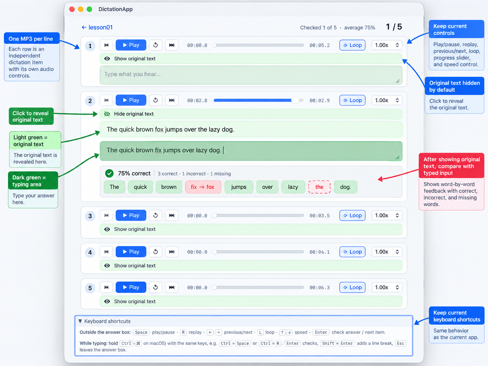

# DictationApp

**Turn any English text into focused dictation practice.**
Import a lesson, get natural-sounding audio for every sentence, listen as often as you need, type
what you hear, and see exactly which words you missed.

**英语听写练习桌面应用**：导入英文文本，逐句生成自然语音，反复听、边听边打，逐词标出听错和漏掉的词。




## Features

- **One clip per sentence.** Audio is generated with Microsoft Azure neural voices (US, UK,
  Australian and more) or ElevenLabs voices, whichever you pick in Settings, and cached on your
  computer, so replaying never costs another request.
- **A player built for dictation.** Play, pause, replay, loop, seek and change speed from 0.6× to
  1.25×, all from the keyboard without leaving the answer box.
- **Type first, then look.** The original text stays hidden until you choose to show it.
- **Word-by-word feedback.** Every word is marked correct, wrong (`fix → fox`), missing or extra,
  with an accuracy score. Small words such as *the*, *a* and *to* always count.
- **Pick up where you left off.** Answers are saved as you type; reopen a lesson and continue from
  the last sentence. Clear them whenever you want to start over.
- **Track your progress.** Attempts and best accuracy for every sentence.
- **Shadowing with the same lesson.** Read aloud along with the audio: loop a passage you stumble
  on, with a pause to repeat it aloud, then play the whole article and read along.
- **Your data stays local.** Lessons, answers and progress live in a local SQLite database; only the
  lesson text is sent to the text-to-speech provider you chose, to generate audio.
- **Plain-text lessons.** Any UTF-8 `.txt` file with passages separated by blank lines is a lesson.

## How it works

1. **Import** a `.txt` file (try [`examples/lesson01.txt`](examples/lesson01.txt)); each passage
   becomes one dictation item.
2. **Generate audio** once with your Azure Speech or ElevenLabs key; every passage gets its own MP3.
3. **Dictation**: listen, type what you hear, press **Enter** to reveal the original and see your
   mistakes, and **Enter** again for the next sentence.
4. **Shadowing**: with the text in view, loop a hard passage until you read it smoothly, then play
   the whole article and read along.

Built with Tauri 2, Rust, React 19 + TypeScript and SQLite, for macOS, Windows and Linux. You need
your own [Azure Speech](https://azure.microsoft.com/products/ai-services/text-to-speech) key (the
free tier covers typical personal use) or [ElevenLabs](https://elevenlabs.io) API key.

## Download

Get the installer for your computer from the
[latest release](https://github.com/richardgong1987/DictationApp/releases/latest): a `.dmg` for Mac
(Apple Silicon and Intel), a `-setup.exe` or `.msi` for Windows, and an `.AppImage`, `.deb` or
`.rpm` for Linux. The release page explains the one-time step to open an app that is not code-signed.

---

## Getting Started

### Prerequisites

- [Rust](https://rustup.rs/) (stable, 1.77+)
- Node.js 20+ (22.18+ to run `pnpm test`, which uses Node's built-in TypeScript support) and
  pnpm 10 (`corepack enable pnpm`)
- Tauri system dependencies for your OS — see <https://v2.tauri.app/start/prerequisites/>
  (on Debian/Ubuntu: `libwebkit2gtk-4.1-dev build-essential libssl-dev libayatana-appindicator3-dev librsvg2-dev`)
- A Microsoft Azure Speech resource (key + region), or an ElevenLabs API key

### Run

```bash
pnpm install
cp .env.example .env        # then put your Azure key/region or ElevenLabs key in .env
pnpm tauri dev
```

Pick the text-to-speech provider (Azure Speech or ElevenLabs) in the app's **Settings** screen.
Credentials are resolved in this order:

1. `AZURE_SPEECH_KEY` / `AZURE_SPEECH_REGION` and `ELEVENLABS_API_KEY` environment variables
   (a `.env` file in the working directory or in the app data directory is loaded at startup);
2. keys entered in the app's **Settings** screen (stored unencrypted in the local app data folder).

### Build an installer

```bash
pnpm tauri build
```

On a Mac, `./package.sh` builds just the universal `.dmg` (Apple Silicon and Intel);
`./package.sh --native` builds one for the current Mac only, which is faster.

`./package.sh --ios` builds a signed `.ipa` for iPhone and iPad, and `./package.sh --ios-simulator`
an unsigned app for the iOS Simulator. Both need Xcode's iOS platform
(`xcodebuild -downloadPlatform iOS`) and `brew install cocoapods xcodegen`. `--ios` signs for the
team of your Apple Development certificate; if you have certificates from several teams, set
`APPLE_DEVELOPMENT_TEAM` to one (Xcode → Settings → Accounts). The Xcode project lives in
`src-tauri/gen/apple`; the first iOS build generates it.

`./install-ios.sh` builds the `.ipa`, installs it on the iPhone connected to this Mac and opens it.
The first time, turn on Developer Mode on the iPhone (Settings → Privacy & Security), and after the
install trust your certificate (Settings → General → VPN & Device Management). With a free Apple
account the app stops opening after 7 days; run the script again to sign it anew.

### Publish a release

Push a version tag, or publish a release with such a tag on GitHub:

```bash
git tag v0.2.0
git push origin v0.2.0
```

`.github/workflows/release.yml` then builds the macOS, Windows and Linux installers, attaches them to
the release for that tag and publishes it once every build has succeeded. The version comes from the
tag, which must look like `v1.2.3`. A new release gets the download instructions in
`.github/release-notes.md` as its description.

### Tests and checks

```bash
cd src-tauri && cargo test     # parsing, cache keys, TTS requests, answer comparison, database, IPC commands
pnpm build                     # TypeScript type check + frontend build
pnpm test                      # shadowing player: modes, repeat pause, switching, cleanup
```

### Using the app

1. **Lessons → Paste text**: paste passages separated by blank lines, the easy way on a phone.
   Or **Import .txt lesson**: pick a UTF-8 text file in the same format.
2. Audio for every passage is generated with the provider chosen in Settings (one MP3 per passage)
   and cached; reopening a lesson never calls it again for audio that already exists.
3. **Dictation**: listen, type what you hear, press **Enter** to check, **Enter** again for the next passage.
4. **Shadowing**: **Loop passage** repeats one passage with a pause to repeat it aloud (set it with
   **Time to repeat aloud**); **Play article** plays every passage in order without pauses.

Keyboard shortcuts on the dictation screen:

| Key (outside the answer box) | While typing in the answer box | Action |
|---|---|---|
| Space | Ctrl/⌘ + Space | Play / Pause |
| R | Ctrl/⌘ + R | Replay from the beginning |
| ← / → | Ctrl/⌘ + ← / → | Previous / next item |
| L | Ctrl/⌘ + L | Toggle loop |
| ↑ / ↓ | Ctrl/⌘ + ↑ / ↓ | Faster / slower |
| Enter | Enter | Check answer, then next item |
| — | Shift + Enter | Line break |
| — | Esc | Leave the answer box |

---

> The rest of this document is the V1 specification the app was built from, followed by
> implementation notes.

## 1. Product Goal

DictationApp is a personal desktop tool for improving English listening accuracy through repeated short dictation exercises.

The main use case is:

- prepare 10-30 short English passages;
- keep each passage reasonably short, ideally no more than about 30 words;
- generate natural English audio using Microsoft Azure Speech;
- practice one passage at a time;
- pause or replay audio instantly;
- loop the current passage as many times as needed;
- type the sentence from listening;
- reveal/check the original text when ready;
- continue to the previous or next passage.

The player experience is the most important part of the application.

---

## 2. Proposed Technology Stack

Use the following stack unless there is a strong technical reason to change it:

- **Desktop framework:** Tauri
- **Backend/core:** Rust
- **Frontend:** React + TypeScript
- **Local persistence:** SQLite
- **TTS provider:** Microsoft Azure Speech / Text-to-Speech REST API
- **Audio format:** MP3
- **HTTP client:** `reqwest`
- **Serialization:** `serde`
- **Async runtime:** `tokio`

The application should work locally without requiring a separate backend server.

---

## 3. MVP Scope

### 3.1 Lesson input

A lesson is represented by a UTF-8 `.txt` file.

A single file can contain multiple short passages.

For MVP, use a blank line as the delimiter between passages.

Example:

```text
I should have told you earlier.

The meeting has been moved to Friday afternoon.

If I had known about the problem, I would have called you.

She doesn't usually take the train to work.
```

This file represents four dictation items.

Rules:

- ignore leading and trailing whitespace;
- ignore empty items;
- preserve punctuation in the source text;
- show a warning when an item contains more than 30 words;
- do not automatically split on periods, because a passage may contain more than one sentence;
- blank lines are the authoritative separator.

Later versions may support Markdown, JSON, YAML, or an internal editor, but the MVP should keep the text format simple.

---

## 4. Lesson Processing

When a lesson is imported:

1. read the text file;
2. split content by blank lines;
3. trim each item;
4. assign each item an index;
5. store lesson metadata locally;
6. generate or locate its cached audio.

Example:

```text
lesson01.txt

Item 1 -> 001.mp3
Item 2 -> 002.mp3
Item 3 -> 003.mp3
Item 4 -> 004.mp3
```

Recommended local structure:

```text
data/
└── lessons/
    └── <lesson-id>/
        ├── source.txt
        ├── metadata.json
        └── audio/
            ├── 001.mp3
            ├── 002.mp3
            ├── 003.mp3
            └── 004.mp3
```

The exact storage location should use Tauri's application data directory rather than assuming a fixed working-directory path.

---

## 5. Microsoft Azure TTS

Audio is generated from each individual dictation item.

Do **not** generate one large MP3 for the complete lesson in the MVP.

Generating one audio file per item makes the player much simpler and enables precise replay and looping without maintaining timestamps inside a large file.

Expected flow:

```text
Text item
   |
   v
Generate cache key
   |
   +--> cached audio exists --> use local MP3
   |
   +--> no cache -----------> Azure TTS API
                                  |
                                  v
                              save MP3
                                  |
                                  v
                               play
```

### 5.1 Audio caching

Do not call Azure every time the user presses Replay.

Create a deterministic cache key based on at least:

- text;
- voice;
- speaking rate;
- pitch if supported/configured;
- relevant output settings.

Conceptually:

```text
SHA-256(text + voice + rate + pitch + output_format)
```

If the cache exists, reuse the local audio file.

### 5.2 Azure credentials

Never commit Azure subscription keys to Git.

For local development, credentials may be read from environment variables such as:

```text
AZURE_SPEECH_KEY
AZURE_SPEECH_REGION
```

Provide an `.env.example`, but never commit a real `.env`.

Longer term, credentials should be stored using an OS-appropriate secure mechanism.

---

## 6. Audio Player Requirements

The player is the central feature of DictationApp.

It should feel immediate and keyboard-friendly.

Required controls:

- Play
- Pause
- Replay current item from the beginning
- Previous item
- Next item
- Loop current item
- Seek within the current audio
- Playback speed control

Suggested speeds:

```text
0.60x
0.75x
0.90x
1.00x
1.10x
1.25x
```

The player should display:

- current lesson;
- current item number;
- total item count;
- current playback time;
- total duration;
- progress/seek bar;
- current playback speed;
- loop state.

### 6.1 Replay behavior

Replay must immediately restart the current audio:

```text
currentTime = 0
play()
```

It must not call Azure again.

### 6.2 Loop behavior

When loop mode is enabled, the current item should automatically restart when it finishes.

Optional later enhancement:

- configurable delay between repetitions;
- repeat exactly N times;
- auto-pause after N repetitions.

### 6.3 Keyboard shortcuts

MVP should support keyboard control.

Suggested mapping:

| Key | Action |
|---|---|
| Space | Play / Pause |
| R | Replay current item |
| Left Arrow | Previous item |
| Right Arrow | Next item |
| L | Toggle loop |
| Up Arrow | Increase speed |
| Down Arrow | Decrease speed |
| Enter | Check answer |

Keyboard shortcuts must not interfere with normal typing inside the dictation answer input. For example, letters typed while the answer field has focus should remain text input unless a modifier-based shortcut is used.

---

## 7. Dictation Practice Screen

The main practice screen should stay minimal.

Example layout:

```text
-------------------------------------------------
Lesson: Daily English 01              4 / 20
-------------------------------------------------

                 [ audio controls ]

          00:02.4 ----------- 00:05.8

          [ Replay ] [ Loop ] [ 1.0x ]

-------------------------------------------------

Type what you hear:

+-----------------------------------------------+
|                                               |
|                                               |
+-----------------------------------------------+

             [ Check Answer ]

-------------------------------------------------
```

The original sentence should be hidden before the user checks the answer.

After checking:

- show the original text;
- show the user's text;
- highlight differences;
- allow replaying the audio again;
- allow moving to the next item.

---

## 8. Answer Comparison

The MVP should provide both normalized comparison and useful word-level differences.

Before comparison:

- trim leading/trailing spaces;
- normalize repeated whitespace;
- compare case-insensitively;
- optionally ignore punctuation for the listening score.

However, do **not** silently ignore meaningful missing words such as:

- articles: `a`, `an`, `the`;
- prepositions;
- auxiliaries;
- pronouns;
- plural endings;
- verb forms.

Example:

```text
Source:
I should have told you earlier.

User:
I should told you early.
```

The UI should make it clear that `have` is missing and `early` differs from `earlier`.

The exact diff algorithm can evolve. Keep the implementation modular so a better word-level or token-level diff can replace the MVP algorithm later.

---

## 9. Suggested Data Model

The exact schema can evolve, but the MVP should roughly support these entities.

### Lesson

```text
id
title
source_path
created_at
updated_at
```

### DictationItem

```text
id
lesson_id
position
text
audio_path
audio_cache_key
created_at
```

### Attempt

```text
id
dictation_item_id
answer
is_correct
accuracy
replay_count
created_at
```

Settings such as voice and playback speed can initially be stored using a lightweight application settings mechanism.

---

## 10. Application Screens

MVP should include three main areas.

### Lesson Library

- list imported lessons;
- import a text file, or paste text;
- open a lesson;
- regenerate missing audio;
- delete a lesson from local application data.

### Lesson Detail

- display lesson title;
- list all items;
- display audio generation status;
- optionally regenerate one item;
- start practice.

### Practice

- audio player;
- answer input;
- Check Answer;
- previous / next;
- replay;
- loop;
- speed;
- progress.

Do not over-design the UI in the first implementation.

---

## 11. Rust Responsibilities

Rust/Tauri should handle:

- local file import;
- lesson parsing;
- application data paths;
- Azure Speech API requests;
- MP3 caching;
- cache-key generation;
- SQLite access;
- configuration;
- validation;
- exposing commands to the frontend.

Suggested modules:

```text
src-tauri/src/
├── main.rs
├── lib.rs        (app setup, command registration)
├── commands.rs
├── lesson.rs
├── tts.rs
├── cache.rs
├── compare.rs    (answer normalization and word diff)
├── database.rs
├── models.rs
├── settings.rs
└── error.rs
```

(The implemented layout groups these by feature; see [Code layout](#code-layout) under Implementation Notes.)

Keep Azure-specific code behind a small TTS abstraction so another provider can be added later if desired.

For example:

```rust
trait TtsProvider {
    async fn synthesize(&self, request: TtsRequest) -> Result<Vec<u8>, TtsError>;
}
```

The exact trait implementation can be adjusted based on Rust async-trait limitations and project dependencies.

---

## 12. Frontend Responsibilities

React/TypeScript should handle:

- lesson/library UI;
- practice state;
- audio playback;
- seek bar;
- playback rate;
- loop mode;
- keyboard shortcuts;
- answer entry;
- answer/diff presentation.

Use the browser/WebView audio API for normal playback rather than routing every playback operation through Rust.

The Rust side should prepare and expose the local audio resource. The frontend should own interactive playback state.

---

## 13. Non-Goals for MVP

Do not implement these until the core workflow is working:

- user accounts;
- cloud synchronization;
- mobile app;
- social features;
- AI-generated lessons;
- Whisper transcription;
- speech recognition;
- pronunciation scoring;
- large analytics dashboards;
- spaced repetition engine;
- online backend server;
- multi-user support.

Avoid adding complexity simply because it may be useful later.

---

## 14. Development Principles

Claude Code or any implementation agent working on this repository should follow these principles:

1. Build the smallest usable vertical slice first.
2. Keep the application runnable after every meaningful step.
3. Prefer clear Rust types and small modules over premature abstractions.
4. Do not put Azure credentials in source code.
5. Do not call Azure again when a cached audio file is available.
6. Do not generate a single large audio file for a complete lesson in MVP.
7. Keep audio playback responsive and frontend-driven.
8. Keep text parsing rules deterministic.
9. Add tests for parsing, cache-key generation, and answer normalization.
10. Avoid implementing features outside the documented MVP unless required by an existing dependency or technical constraint.

---

## 15. Recommended Implementation Order

### Phase 1 - Project skeleton

- initialize Tauri;
- initialize React + TypeScript;
- verify desktop application launches;
- establish Rust-to-frontend Tauri command communication.

### Phase 2 - Lesson import

- select a `.txt` file;
- read it in Rust;
- split by blank lines;
- return parsed items to React;
- display the items;
- warn for passages longer than 30 words.

### Phase 3 - Azure TTS

- configure Azure Speech key/region;
- implement one-item TTS generation;
- save generated MP3 locally;
- implement deterministic caching;
- test with one item;
- batch-generate missing lesson audio.

### Phase 4 - Player

- play current item;
- pause;
- seek;
- replay;
- previous / next;
- loop;
- speed control;
- keyboard shortcuts.

### Phase 5 - Dictation workflow

- hide source text during practice;
- add answer input;
- add Check Answer;
- normalize answer;
- show word-level diff;
- navigate between items.

### Phase 6 - Persistence

- add SQLite;
- persist lessons and items;
- persist attempts;
- persist user settings.

### Phase 7 - Polish

- error messages;
- loading/progress indicators;
- retry failed TTS generation;
- improve keyboard workflow;
- basic tests;
- README setup instructions;
- packaging.

---

## 16. Definition of Done for V1

V1 is complete when a user can:

1. launch the desktop application;
2. import a text file containing multiple passages separated by blank lines;
3. see the parsed passages;
4. generate Azure TTS audio for each passage;
5. reopen the lesson without regenerating existing audio;
6. start dictation practice;
7. play/pause/replay/loop the current passage;
8. move to previous or next passage;
9. change playback speed;
10. type an answer without seeing the source;
11. check the answer and see differences;
12. close and reopen the application without losing imported lessons.

Anything beyond this is optional for V1.

---

## 17. Example Input

```text
I haven't seen him since last Monday.

He told me that he would call me back.

I didn't realize how difficult it was going to be.

Would you mind closing the window?

There isn't enough time to finish everything today.
```

Expected generated audio:

```text
001.mp3
002.mp3
003.mp3
004.mp3
005.mp3
```

Each MP3 corresponds to exactly one text block.

---

## 18. Future Ideas

Possible later features:

- multiple Azure voices;
- US / UK / Australian accent presets;
- configurable TTS speaking rate;
- random voice mode;
- automatic repeat N times;
- repeat delay;
- weak-word/error statistics;
- spaced repetition;
- custom tags;
- lesson editor;
- import/export lesson packs;
- Whisper-based transcription;
- automatic lesson generation;
- cloud sync.

These are future ideas, not MVP requirements.

---

## Implementation Notes

Decisions made while implementing V1, where the specification left room:

- **Wrapped lines**: lines inside one passage (no blank line between them) are joined with a single space.
- **Audio delivery**: Rust returns an item's MP3 bytes over IPC (`get_item_audio`); the frontend plays them
  through a `Blob` URL with a regular `HTMLAudioElement`. No asset-protocol scope is needed, and all
  playback state (pause, seek, loop, speed) stays in the WebView. The CSP in `tauri.conf.json` must
  keep `connect-src ipc: http://ipc.localhost`: without it Tauri falls back to its postMessage IPC,
  which hands the MP3 over as an array of numbers instead of an `ArrayBuffer`, and installed builds
  play no audio (dev builds apply no CSP, so they still work).
- **Cache key**: `SHA-256("v1", text, voice, rate, pitch, output_format)`, fields separated by `0x1F`;
  ElevenLabs keys append `"elevenlabs", model`. Azure keys deliberately keep the original recipe so
  audio generated before ElevenLabs support stays current. Audio is stored as
  `lessons/<lesson-id>/audio/NNN.mp3` and the key is saved with the item. If the provider or voice
  settings change, the item shows "Voice changed" and is regenerated on the next generation or
  practice. There is one file per item, so switching providers back and forth means regenerating.
- **Azure**: REST endpoint `https://<region>.tts.speech.microsoft.com/cognitiveservices/v1`, output
  `audio-24khz-48kbitrate-mono-mp3`.
- **ElevenLabs**: REST endpoint `https://api.elevenlabs.io/v1/text-to-speech/<voice-id>`, output
  `mp3_44100_128`, model `eleven_multilingual_v2` by default. The speaking rate maps to
  `voice_settings.speed` (0.7–1.2, so −30% to +20%); pitch is not supported and ignored. At normal
  speed `voice_settings` is left out so the voice keeps its own settings.
- Both providers retry with backoff on network errors, 429 and 5xx (`tts/http.rs`). Lesson generation
  runs one item at a time to stay within free-tier rate limits.
- **Answer comparison** is implemented in Rust (`practice/comparison.rs`): case and surrounding punctuation are
  ignored, curly apostrophes are normalized, and every word counts. The diff is an LCS over words;
  missing and extra words between two matches are paired as "changed". Accuracy is
  `correct words / max(source words, answer words)`.
- **Settings** (TTS provider, each provider's voice, TTS rate/pitch, player speed/loop, optional
  credentials) are stored as JSON in the SQLite `settings` table. The Azure voice used to be stored as
  `voice`; that name is still read.
- `metadata.json` in each lesson folder is written for readability; SQLite (`dictation.db` in the app
  data directory) is the source of truth.
- **Saved answers**: the latest answer to each item is kept in the `answers` table (schema v2), exactly
  as typed, with a status: `draft` (typed or edited since its last check) or `checked`. Typing saves a
  draft once it pauses for half a second; "Show original text" saves it as checked, in the same
  transaction as the attempt. Clearing the text deletes the saved answer, and "Clear answers" in the
  practice header deletes all of a lesson's answers (attempts are kept). The result of a checked answer
  is recomputed when the lesson is opened rather than stored. `attempts` stays the full history of
  checks behind the statistics.
- **Resuming**: opening practice without choosing an item continues with the item answered last, or the
  next one if that answer is already checked (`practice::resume_item_id`).
- **Schema upgrades** run at startup, in order, recorded in `PRAGMA user_version` (`database.rs`).
- **Credentials** from `AZURE_SPEECH_KEY` / `AZURE_SPEECH_REGION` / `ELEVENLABS_API_KEY` are read once
  at startup and passed to the settings service; no business code reads environment variables.

### Code layout

The backend is grouped by feature. Inside a feature, `mod.rs` holds its types and rules,
`repository.rs` its SQL, and `service.rs` its workflows. Commands stay thin: they unpack arguments
and call one service.

```text
src-tauri/src/
├── lib.rs            startup: .env, database, AppState, command registration
├── app_state.rs      composition root: builds every repository and service once
├── commands.rs       the IPC surface (mirrored by src/api/client.ts)
├── database.rs       SQLite connection and schema
├── error.rs          AppError; each variant's text is what the user sees
├── lesson/           Lesson, DictationItem, response shapes
│   ├── parser.rs       blank-line splitting (the lesson text format)
│   ├── files.rs        lessons/<id>/{source.txt, metadata.json, audio/NNN.mp3}
│   ├── repository.rs   lessons + dictation_items tables
│   └── service.rs      import, list, detail, delete
├── audio/            generation summary/progress types
│   ├── cache.rs        cache key, Ready/Stale/Missing, reuse-or-synthesize
│   └── service.rs      lesson/item generation, one run per lesson at a time
├── practice/         ItemStats, CheckResult
│   ├── comparison.rs   normalization + LCS word diff
│   ├── repository.rs   attempts table + per-item stats
│   └── service.rs      check an answer and record the attempt
├── settings/         Settings, sanitizing, credential precedence
│   ├── repository.rs   settings stored as one JSON row
│   └── service.rs      load/save, player preferences, credentials
└── tts/              TtsProvider trait, TtsRequest, provider choice (TtsProviderKind, TtsClient)
    ├── azure.rs        Azure REST client, SSML
    ├── elevenlabs.rs   ElevenLabs REST client
    └── http.rs         request retries with backoff, shared by both
```

The frontend keeps a screen's helpers next to the screen; only code shared by several screens
lives outside `screens/`.

```text
src/
├── App.tsx           route → screen
├── navigation.ts     Route type
├── api/              typed command wrappers, response types, constants shared with Rust
├── audio/            item MP3s as Blob URLs and clip lengths, shared by dictation and shadowing
├── components/       ErrorBanner, LoadingPage, EyeIcons
├── format.ts         time/speed/percent formatting
└── screens/
    ├── LibraryScreen.tsx
    ├── SettingsScreen.tsx
    ├── lesson/       LessonScreen, item row, audio generation hook and status
    ├── shadowing/
    │   ├── ShadowingScreen.tsx       loads the lesson
    │   ├── ShadowingSession.tsx      article player on top, one row per passage
    │   ├── ArticlePlayer.tsx         play the whole article, restart, loop
    │   ├── PassageRow.tsx            one passage: its player, "Your turn" countdown, text
    │   ├── shadowingPlayer.ts        the one player: article and passage modes, repeat pause
    │   └── useShadowingPlayer.ts     creates it, renders its state, stops it on leaving
    └── practice/     dictation
        ├── PracticeScreen.tsx        loads the lesson and player preferences
        ├── PracticeSession.tsx       all items as cards; wires player, answers and shortcuts
        ├── PracticeItemCard.tsx      one item: player row, original text, answer, feedback
        ├── PlayerPanel.tsx           audio controls of one card
        ├── AnswerResult.tsx          score and word chips (DiffView.tsx) of a checked answer
        ├── useAudioPlayer.ts         the one HTMLAudioElement: play, seek, loop, speed
        ├── useCurrentItemAudio.ts    loads the current item's audio into the player
        ├── usePracticeProgress.ts    each item's answer: saved as typed, checked, revealed, hidden
        └── usePracticeShortcuts.ts   key → command table
```

The practice screen shows every item as a card, but there is one audio player: the current card
(blue border) is the one loaded in it and the one the keyboard shortcuts act on. "Show original
text" checks the answer before revealing it; hiding it again makes the answer editable, and showing
it again re-checks only if the answer changed. Answers are kept between sessions, and "Dictation"
continues where you stopped; the ▶ on an item in the lesson screen starts from that item instead.

The shadowing screen uses the same items and cached audio but keeps nothing: no answers, no
statistics, and its speed and pause choices last for the visit only. One `ShadowingPlayer` owns its
single audio element and the "Your turn" timer, so the article and a looping passage never overlap,
and leaving the screen stops both.

---